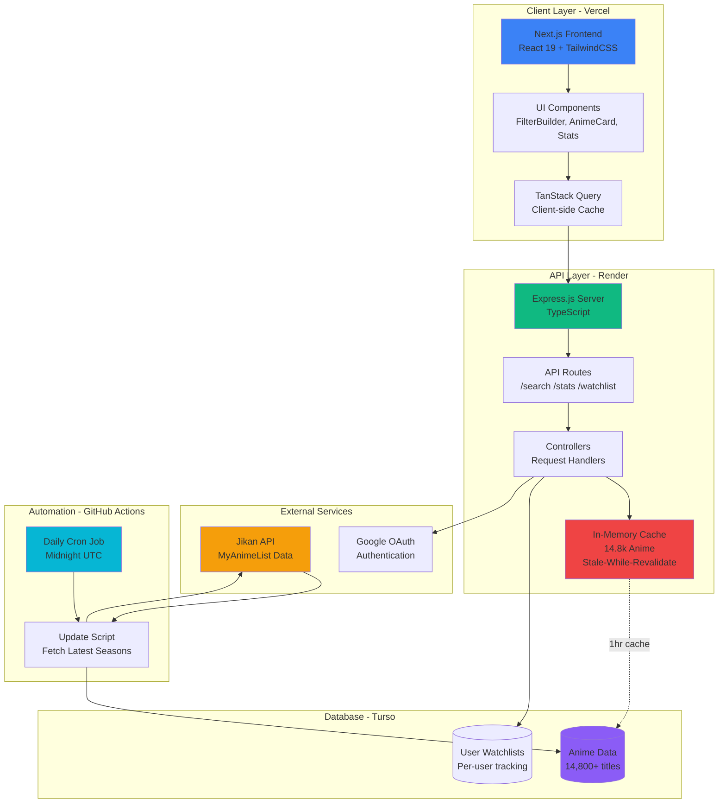

# MAL Explorer

A modern anime discovery platform that helps you find your next favorite show.

**Live Demo**: [anime-explorer-mal.vercel.app](https://anime-explorer-mal.vercel.app)

## The Problem

Finding quality anime to watch is hard. MyAnimeList has thousands of titles, but the platform lacks advanced filtering, intelligent ranking, and personal tracking across multiple dimensions. Most discovery tools either overwhelm with options or oversimplify with basic genre filters.

## Features

- **Advanced Filtering**: Multi-dimensional search across score, year, genres, themes, demographics with powerful operators (includes all/any, excludes, numeric comparisons)
- **Smart Ranking**: Custom algorithm balancing quality (MAL score) and popularity (members + favorites) using logarithmic scaling to give hidden gems a chance
- **Personal Watchlists**: Track anime by status (Watching, Completed, Deferred, Avoiding, BRR) with Google authentication
- **Rich Statistics**: Explore trends, score distributions, and popular genre combinations across 14,800+ titles with watchlist filtering
- **Lightning Fast**: Sub-millisecond response times with stale-while-revalidate caching and Turso database
- **Auto-Updates**: GitHub Actions automatically fetches latest anime seasons daily at midnight UTC

## Architecture



### Key Components

- **Frontend (Vercel)**: Next.js 15 with App Router, TailwindCSS 4 + shadcn/ui components
- **Backend (Render)**: Express.js API with stale-while-revalidate in-memory cache for <1ms response times
- **Database (Turso)**: libSQL database storing anime data (14,800+ titles) and user watchlists
- **Caching Strategy**: 1-hour TTL with background refresh - 100% of requests served instantly from memory
- **Automation (GitHub Actions)**: Daily cron at midnight UTC fetches latest anime seasons from Jikan API
- **External APIs**: Jikan API for MyAnimeList data, Google OAuth for authentication

## Quick Start

### Prerequisites
- Node.js 18+
- Turso account (free tier)
- Google OAuth credentials

### Setup

1. Clone and install:
```bash
git clone <repository-url>
cd mal
npm install
```

2. Create `.env` file:
```env
TURSO_DATABASE_URL=your-database-url
TURSO_AUTH_TOKEN=your-auth-token
JWT_SECRET=your-secret
GOOGLE_CLIENT_ID=your-google-client-id
PORT=8080
```

3. Start development server:
```bash
npm run dev
```

Both backend (port 8080) and frontend (port 3000) will start concurrently.

4. Open http://localhost:3000

### Available Commands

```bash
npm run dev        # Run both backend and frontend
npm run dev:be     # Backend only
npm run dev:fe     # Frontend only
npm run build      # Build for production
npm start          # Start production server
npm run db:seed    # Seed Turso database from JSON (one-time)
npm run db:update  # Update anime data from MAL API
```

## Deployment

**Frontend (Vercel)**
- Auto-deploys on push to main
- Configure environment variables in Vercel dashboard

**Backend (Render)**
- Auto-deploys from `render.yaml` on push to main
- Configure `TURSO_DATABASE_URL`, `TURSO_AUTH_TOKEN`, `JWT_SECRET`, `GOOGLE_CLIENT_ID` in environment variables

**Database (Turso)**
- Create database: `turso db create mal-watchlist`
- Get credentials: `turso db show mal-watchlist`
- Run migrations and seed: `npm run db:seed`

**GitHub Actions (Automated)**
- Add repository secrets: `TURSO_DATABASE_URL`, `TURSO_AUTH_TOKEN`
- Workflow runs automatically daily at midnight UTC
- Manual trigger: Go to Actions tab → "Update Anime Data" → Run workflow

---

**Note**: This project uses MyAnimeList data via the Jikan API. Not affiliated with MyAnimeList.net.

**For Developers**: See [AGENTS.md](AGENTS.md) for comprehensive technical documentation.

## License

ISC - Sarthak Agrawal
