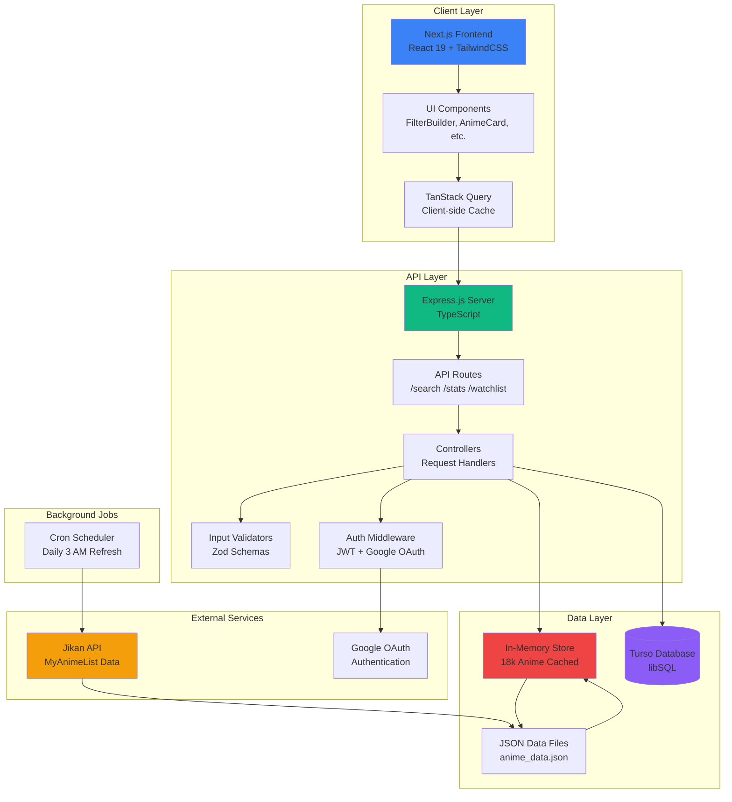

# MAL Explorer

A modern anime discovery platform that helps you find your next favorite show.

**Live Demo**: [anime-explorer-mal.vercel.app](https://anime-explorer-mal.vercel.app)

## The Problem

Finding quality anime to watch is hard. MyAnimeList has thousands of titles, but the platform lacks advanced filtering, intelligent ranking, and personal tracking across multiple dimensions. Most discovery tools either overwhelm with options or oversimplify with basic genre filters.

## Features

- **Advanced Filtering**: Multi-dimensional search across score, year, genres, themes, demographics with powerful operators (includes all/any, excludes, numeric comparisons)
- **Smart Ranking**: Custom algorithm balancing quality (MAL score) and popularity (members + favorites) using logarithmic scaling to give hidden gems a chance
- **Personal Watchlists**: Track anime by status (Watching, Completed, Deferred, Avoiding, BRR) with Google authentication
- **Rich Statistics**: Explore trends, score distributions, and popular genre combinations across 15,000+ titles
- **High Performance**: Search through 18,000 items in ~100ms with in-memory caching and efficient pagination

## Architecture



### Key Components

- **Frontend**: Next.js 15 with server-side rendering, TailwindCSS 4 + shadcn/ui components
- **Backend**: Express.js API with TypeScript, in-memory data store for fast filtering
- **Database**: Turso (libSQL) for user watchlists and authentication
- **External APIs**: Jikan API for MyAnimeList data, Google OAuth for authentication
- **Background Jobs**: Daily cron job refreshes anime data at 3 AM

## Quick Start

### Prerequisites
- Node.js 18+
- Turso account (free tier)
- Google OAuth credentials

### Setup

1. Clone and install:
```bash
git clone <repository-url>
cd mal
npm install
```

2. Create `.env` file:
```env
TURSO_DATABASE_URL=your-database-url
TURSO_AUTH_TOKEN=your-auth-token
JWT_SECRET=your-secret
GOOGLE_CLIENT_ID=your-google-client-id
PORT=8080
```

3. Start development server:
```bash
npm run dev
```

Both backend (port 8080) and frontend (port 3000) will start concurrently.

4. Open http://localhost:3000

### Available Commands

```bash
npm run dev        # Run both backend and frontend
npm run dev:be     # Backend only
npm run dev:fe     # Frontend only
npm run build      # Build for production
npm start          # Start production server
```

## Deployment

**Frontend (Vercel)**
- Auto-deploys on push to main
- Configure environment variables in Vercel dashboard

**Backend (Docker)**
```bash
docker build -t mal-backend .
docker run -p 8080:8080 --env-file .env mal-backend
```

---

**Note**: This project uses MyAnimeList data via the Jikan API. Not affiliated with MyAnimeList.net.

**For Developers**: See [AGENTS.md](AGENTS.md) for comprehensive technical documentation.

## License

ISC - Sarthak Agrawal
